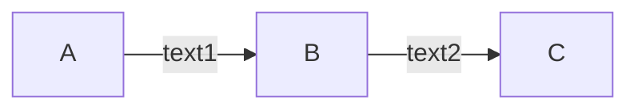
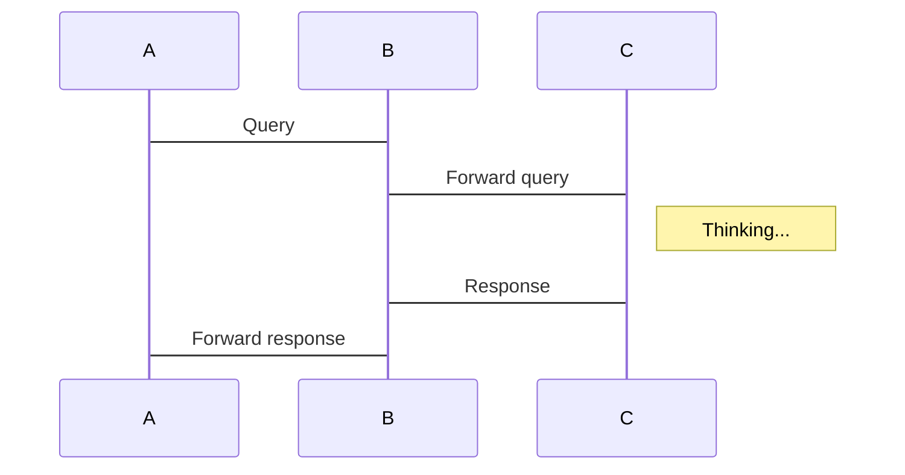
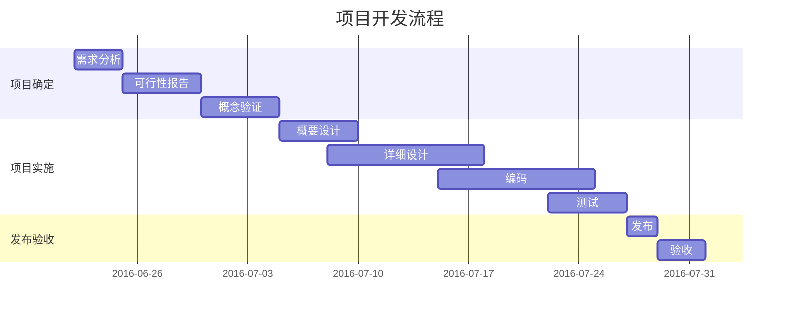

[TOC]

全文分为3个部分，可按需阅读：快速入门、进阶语法、高阶语法

# 快速入门
> 常用功能，快速入门，适合新手

## 支持6级标题

1. 有序列表1
1. 有序列表2


- 无序列表
* 无序列表


**这样可以加粗**
*这样可以斜体*
~~这样可以删除~~


>这样可以引用
>***这样加粗斜体引用***


**代码高亮** 
代码块：
``` sql?linenums
--  oracle下批量删除表操作
SELECT 'DROP TABLE '||TABLE_NAME||';' FROM ALL_TABLES
WHERE TABLE_NAME LIKE 'TMP_CCC%'
 
-- 清CCC建立的临时表，在命令窗口执行select出来的结果。执行之前确认下要drop的表对不对
SELECT 'drop table '||owner||'.'||table_name||';' 
  from all_tables WHERE table_name LIKE 'TMP_CCC%' ;
```

单反引号局部高亮，例如 `printf()`函数。

2个反引号` \`` `单行高亮：
``only one line``

转义使用`\`符号，例如：3个反引号` \``` `批量高亮


---
# 进阶语法
> 稍微复杂一些，用途较广

## 链接
直接渲染：https://www.zybuluo.com/yinzhi6367/note/59158

[隐藏网址，点击跳转](http://blog.wiz.cn/feature-markdown.html)


## 配图
小书匠中可直接截屏粘贴，支持七牛云等外部图床
![图片名称][1]


## 表格
支持3种单元格对齐方式

|工具|记录|时间|
|----|:----:|----:|
|xiaoshujiang|CCC|2016|
|GitHub|CCC|2017|

简化写法
工具|记录|时间
----|:----:|----:
xiaoshujiang|CCC|2016
GitHub|CCC|2017


## 嵌套列表
注意缩进2个空格
- 我是第1级
  - 我是第2级
    - 我是第3级

嵌套有序列表
1. 有序第1级
  1.1. 有序第2级
2. 有序第1级
  2.1. 有序第2级
  2.2. 有序第2级

## 嵌套引用
> 数据结构
>> 树
>>> 二叉树


## 时序图
```sequence
Alice->Bob: Hello Bob, how are you?
Note right of Bob: Bob thinks
Bob-->Alice: I am good thanks!
```

</br>

-------------------
# 高阶语法
> 为码字添色，但部分markdown编辑器可能不支持

## 待办列表
- [ ] 更新下一版笔记
- [x] 添加toDoList
- [x] 添加建议绘图


## 支持mathjax公式
左对齐公式，使用反引号` \`` `标记
`!$\sum_{i=0}^n i^2 = \frac{(n^2+n)(2n+1)}{6}$`

居中对齐公式，添加`mathjax!`标记
```mathjax!
$$\sum_{i=0}^n i^2 = \frac{(n^2+n)(2n+1)}{6}$$
```

## 高效绘图
### 流程图
```flow
st=>start: Start
op1=>operation: Your Operation1
op2=>operation: Your Operation2
cond=>condition: Yes or No?
e=>end

st->op1->op2->cond
cond(yes)->e
cond(no)->op2
```

### 序列图
```sequence!
Alice->Bob: Hello Bob, how are you?
Note right of Bob: Bob thinks
Bob-->Alice: I am good thanks!
```

```plantuml!
Alice->Bob: Hello Bob, how are you?
Note right of Bob: Bob thinks
Bob-->Alice: I am good thanks!
 ```

### mermaid作图
流程图：从左至右
```mermaid!
graph LR
　　A-->B;    
　　A-->C;  
　　B-->D;  
　　C-->D;  
```
流程图：从上至下

流程图：箭头标记


序列图


甘特图 ------------------------


统计图
```plot!
{
"data": [ [[0, 0], [1, 1]] ],
"options": { "yaxis": { "max": 1 } }
}
```

【全文完】

~~下面的链接标记插入的图片，不会展示~~


  [1]: http://ovoxywoe6.bkt.clouddn.com/xiaoshuwu/1504424143369.jpg